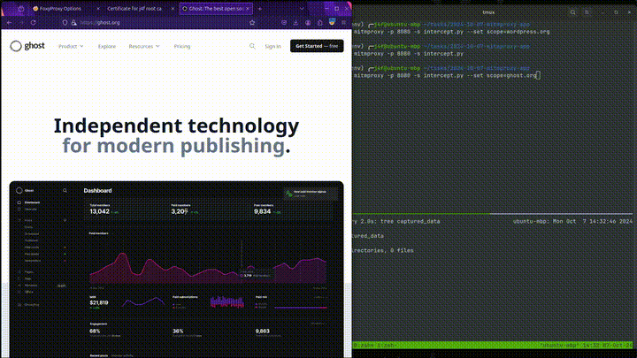

# MITMPROXY APP

A project to understand certificates and proxies.
This app will save all http request while browsing a website 



USAGE 
```bash
. .venv/bin/activate
mitmproxy -p 8080 -s intercept.py # to store all host

# add scope to prevent clutter
mitmproxy -p 8080 -s intercept.py --set scope=ghost.org
```


## Setup
Create SelfSigned RootCA
```bash
# edit metadata
./create_root_cert.sh
```

Convert Root CA Certificate to DER Format
Firefox requires the certificate in DER format.
```bash
openssl x509 -outform der -in myCA.pem -out myCA.crt
```
Import Root CA Certificate into Firefox:
- Open Firefox Preferences:
    > Go to Settings → Privacy & Security → Certificates → View Certificates.
- Import Certificate:
    - Click Import.
    - Select myCA.crt.
    - Check "Trust this CA to identify websites".
- Save Changes.


Dependency
```bash
python -m venv .venv
. .venv/bin/activate
pip instal mitmproxy
```


## LIMITATIONS

The long term goal is to recreate burpsuite proxy features so we can control the output more and pipe the results to our other modules.
- BurpSuite can Proxy even HSTS(like google), mitmproxy cannot yet


### To do
Investigate Burp Suite's Configuration

    Check Burp's SSL/TLS Settings:
        Explore how Burp handles SSL/TLS connections and any additional configurations it uses.

    Look into Burp's CA Installation:
        Burp may suggest installing its CA at the operating system level, which affects all applications, not just the browser.

Use a Browser Without HSTS Preload List:
- A custom or outdated browser might not have the HSTS preload list.